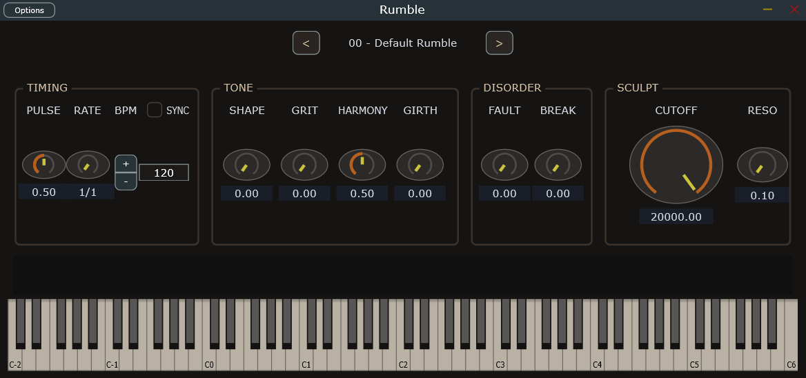

# Rumble | Physics-Based Rhythmic Bass Engine


**A mechanical-instability synthesizer focused on weight, friction, and stochastic movement.**

Rumble is designed with a boutique engineering mindset: constrained controls, strong sonic identity, and deeply tactile rhythmic behavior. Rather than modeling a clean subtractive instrument, it models *mechanical stress* and *timing instability* as first-class musical tools.

## Screenshot



## The Engine

### BrakePhysics

`BrakePhysics` is the friction manifold. It controls how aggressively motion is resisted and broken apart over time, shaping the sense of drag, stall, and release in oscillator behavior. The goal is not sterile interpolation but a weighted, physical feel.

### MotifEngine

`MotifEngine` drives repeatable rhythmic signatures and transport-aware pattern behavior. It provides deterministic motif structure while still allowing controlled entropy from other stages.

## Instability

### Fault

Fault logic introduces stochastic rhythmic skipping and instability events. This produces the “mechanical failure” sensation: timing slips, gated disruptions, and non-linear interruptions that remain musically useful under sync.

## Tone Shaping

### Grit

`Grit` adds saturation/edge to the signal path, pushing the engine from clean low-end movement into aggressive, textured distortion.

### Girth

`Girth` emphasizes weight through sub-focused enhancement and widening behavior tuned for bass-forward motion.

## Technical Specs

- **Language:** C++20
- **Framework:** JUCE
- **Testing:** Catch2

## Build Instructions

For fresh clones, initialize submodules first:

```bash
git submodule update --init --recursive
```

Then configure/build with CMake as usual for your platform/toolchain.

## Installation Notes

### Note for macOS Users

Unsigned builds may be blocked by Gatekeeper on first launch. If so:

1. Right-click the app/plugin host target and choose **Open**.
2. Confirm the security prompt.
3. Repeat once if needed; macOS will remember your choice.

